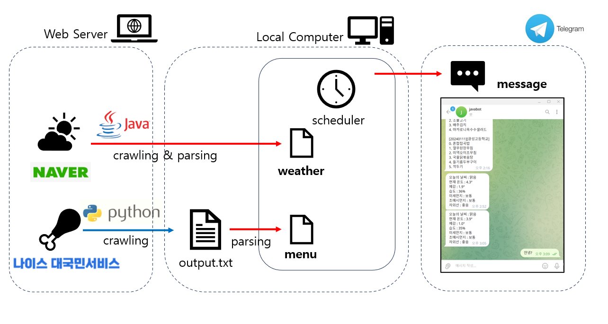

# FISA JAVA MINI-PROJECT 

DATE : 2024-01-12   
MEMBERS : 백성욱, 윤종욱, 우준희, GPT3.5

## INTRO 
교육에서 배운 JAVA 문법과 관련되어 자유 주제를 선정하여 JAVA MINI-PROJECT를 수행했습니다.

## DATAFLOW  

## OBJECTS

|FILE|CLASS|ROLES|
|--|--|
|run_main.java|main|작업 실행|
|webCrawling.py||메뉴 데이터 크롤링|
|webCrawling.java|removeHtmlTags|HTML 파싱|
|webCrawling.java|extractTextBetweenWords|Text 파싱|
|webCrawling.java|parseWeatherInfo|Data 파싱|
|webCrawling.java|Weather|Data 재정렬|
|telebot.java|funcTelegram|Telebot 메세징|
|scheduler.java|scheduler|Task 스케줄링|
|filescanner.java|filescanner|txt 파일 스캐닝|
|executePython.java|executePython|파이썬 파일 실행자|

## TROUBLESHOOTING

<날씨 관련>

처음에 날씨 관련 API를 사용하여 했으나, 기상청 API는 담당자의 승인 시간이 필요하고, 네이버와 카카오는 API를 제공하지 않으며, 그 외의 날씨예보를 전해주는 기관은 API를 유료로 제공하는 등 API에 대한 접근성이 좋지 않았음.
이에 Naver에 "오늘 날씨"를 검색했을 때 나오는 정보를 Crawling하여, 필요한 텍스트 정보를 뽑아내어 사용자에게 당일 날씨에 대한 정보를 제공하기로 함.
처음에 html로 작성된 모든 텍스트 정보를 긁어온 다음, <>로 둘러쌓인 태그를 정규식을 사용해 제거해였고, 특정 단어들 사이에 존재하는 핵심 정보를 가져와 보기 좋은 String 형식으로 변환함.
위의 모든 과정은 WeatherCrawling.java에 작성하였으며, 해당 파일의 Weather() 함수를 사용하게 된다면 최종적으로 사용자에게 보여줄 형식의 날씨 정보만 return하는 형식으로 구성함.
대부분은 크롤링을 Spring framework를 사용하여 진행하였지만, Maven, Gradle등의 개념이 부족하여 흔히 하는 방식으로 진행하지 못한게 어려웠음.
