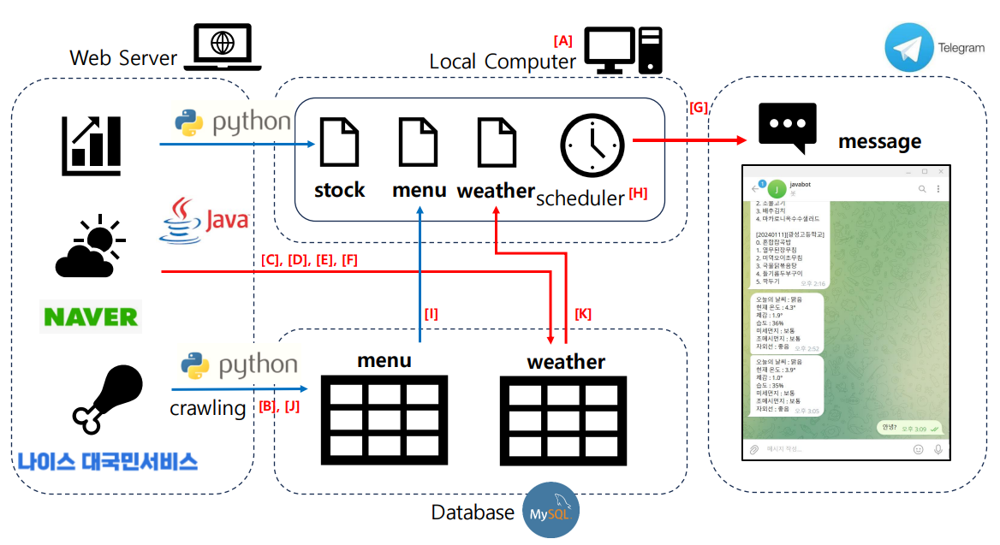

# FISA JAVA MINI-PROJECT 

TEAM : 新욱욱우  
DATE : 2024-01-17        
MEMBERS : 백성욱, 윤종욱, 우준희

## UPDATE NOTE
|Version|Update Date|Revised Content|markdown file|
|1.0.0|2024-01-12|최초 파일 생성|./readme_old20240112.md|
|1.1.0|2024-01-16|JDBC 시스템 구차|./readme_old20240116.md|
|1.1.1|2024-01-12|최초 파일 생성|./readme.md|

## REVIEWS WITH KPT  

### Keep : 잘 했기 때문에 유지하고 싶은 것  
1. 업무의 부가 기능일지라도, 필요한 정보를 Bot을 통해 요약/정리하여 메시지로 전달하는 것은 매우 유용한 기능이라고 생각

### Problem : 어려움을 느껴 계산하고 싶은 것

### 구체적으로 시도할 내용

## DATAFLOW  

