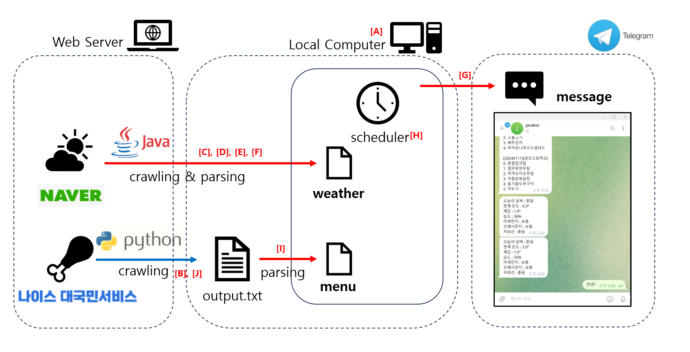

# FISA JAVA MINI-PROJECT 

TEAM : 新욱욱우  
DATE : 2024-01-16        
MEMBERS : 신연재, 백성욱, 윤종욱, 우준희, GPT3.5

## INTRO - 2024/01/12
교육에서 배운 JAVA 문법과 관련되어 자유 주제를 선정하여 JAVA MINI-PROJECT를 수행했습니다.  
강사님께서 저희는 "*처음부터 무언가를 코딩하기보다는 JAVA를 활용하여 다양한 프레임워크와 플랫폼을 활용할 줄 알아야한다*"고 말씀하셔서,
저희가 그것을 조금 해보았습니다.

예비 직장인인 저희들이 가장 관심 있는 것은 "오늘 추운가?"와 "오늘 점심 뭐먹지?"입니다. 저희 팀은 매일 같은 시간에 메뉴 정보와 날씨 정보를 메세지로 전송하는 BOT을 만들었습니다.

## INTRO - 2024/01/16
지난 시간 EXPANSIONS에서 말씀드렸던 것처럼, JDBC를 사용하여 날씨 정보와 식단 정보를 주어진 시간마다 MySQL 데이터베이스에 저장하고 필요한 정보를 불러오는 과정을 추가하였습니다.

## DATAFLOW  

## OBJECTS

|MARK|FILE|METHOD|ROLES|
|--|--|--|--|
|[A]|run_main.java|main|작업 실행|
|[B]|webCrawling.py|webCrawling|메뉴 데이터 크롤링|
|[C]|webCrawling.java|removeHtmlTags|HTML 파싱|
|[D]|webCrawling.java|extractTextBetweenWords|Text 파싱|
|[E]|webCrawling.java|parseWeatherInfo|Data 파싱|
|[F]|webCrawling.java|Weather|Data 재정렬|
|[G]|telebot.java|funcTelegram|Telebot 메세징|
|[H]|scheduler.java|scheduler|Task 스케줄링|
|[I]|filescanner.java|filescanner|txt 파일 스캐닝|
|[J]|executePython.java|executePython|파이썬 파일 실행자|

## EXPANSIONS - 2024/01/12
- JDBC를 활용해서 txt 파일이 아니라 DB에 데이터 관리(불필요한 파일을 생성하지 않음)
- 현 BOT은 print 기능만 있지만, input 기능을 추가하여, 대화형 BOT으로 개선

## COMPLEMENTARY POINT - 2024/01/16
- JDBC를 활용하여 txt 파일이 아니라 DB에 식단 데이터 관리, 매일 아침 날씨 정보를 받아올 때마다 DB에 저장 

## TROUBLESHOOTING - 2024/01/12
1. 백성욱
- 데이터 입수 : 날씨 관련된 API를 사용하려 했으나, API 승인 시간, 유료 결제 등으로 데이터 입수에 어려움을 겪음.
- Spring Boot 필요성 : 대부분의 크롤링 기술은 Maven, Gradle 등 자동화빌더,의존성 도구가 필요했지만, 해당 도구에 대해 활용법을 알지 못해서 사용하지 못함. -> 자바 기본 라이브러리를 사용함.

2. 윤종욱
- 데이터 입수 : 중앙그룹 중식 식단을 API를 통해 추출하려고 하였으나, 관련 API를 제공하지 않는 관계로 공공데이터셋인 급식 식단 API를 사용
- json으로 받고 txt 파일로 변환하는 것을 파이썬에서는 제대로 실행되었지만, 자바에서 실행했을 때 경로 문제로 py가 실행되지 않거나, output 파일의 위치가 예상과는 다른 곳에 생성되는 문제 발생
- 해당 문제는 파이썬 실행 중 실행하는 디렉토리 값을 os.getcwd()를 통해 가져오고, 파일을 저장할 디렉토리를 새로 생성하는 것으로 해결

3. 우준희
- JDBC도 활용하려고 했으나, Springboot 요구
- 초기 SlackBot을 활용하려고 했으나, Springboot 요구
- 다양한 WebCrawling을 구현하려고 했으나, 다양한 Springboot 요구
- 맨 처음 프로젝트에 대한 브레인스토밍에서 다양한 아이디어가 나왔으나, 대부분 gradle, maven, ant에 대한 지식과 Springboot 요구
  
<!--  
처음에 날씨 관련 API를 사용하여 했으나, 기상청 API는 담당자의 승인 시간이 필요하고, 네이버와 카카오는 API를 제공하지 않으며, 그 외의 날씨예보를 전해주는 기관은 API를 유료로 제공하는 등 API에 대한 접근성이 좋지 않았음.
이에 Naver에 "오늘 날씨"를 검색했을 때 나오는 정보를 Crawling하여, 필요한 텍스트 정보를 뽑아내어 사용자에게 당일 날씨에 대한 정보를 제공하기로 함.
처음에 html로 작성된 모든 텍스트 정보를 긁어온 다음, <>로 둘러쌓인 태그를 정규식을 사용해 제거해였고, 특정 단어들 사이에 존재하는 핵심 정보를 가져와 보기 좋은 String 형식으로 변환함.
위의 모든 과정은 WeatherCrawling.java에 작성하였으며, 해당 파일의 Weather() 함수를 사용하게 된다면 최종적으로 사용자에게 보여줄 형식의 날씨 정보만 return하는 형식으로 구성함.
대부분은 크롤링을 Spring framework를 사용하여 진행하였지만, Maven, Gradle등의 개념이 부족하여 흔히 하는 방식으로 진행하지 못한게 어려웠음.-->

<!--  
<식단 관련>
처음 목표는 중앙그룹 중식 식단을 API를 통해 추출하려고 하였으나, 관련 API를 제공하지 않는 관계로 공공데이터셋인 급식 식단 API를 사용하게 되었다.
이번 주의 식단을 json으로 받고 txt 파일로 변환하는 것을 파이썬에서는 제대로 실행되었지만, 자바에서 실행했을 때 경로 문제로 py가 실행되지 않거나, output 파일의 위치가 예상과는 다른 곳에 생성되는 문제가 있었다.
해당 문제는 파이썬 실행 중 실행하는 디렉토리 값을 os.getcwd()를 통해 가져오고, 파일을 저장할 디렉토리를 새로 생성하는 것으로 해결할 수 있었다. -->

## TROUBLESHOOTING - 2024/01/16

1. 신연재

2. 백성욱
- JDBC를 사용할 때, MySQL은 column의 타입이 DATETIME, INT, VARCHAR, DECIMAL등 다양하지만, 자바에서는 String, int, float 등이 주로 사용되기 때문에, 자료형을 어떤 방식으로 다루어야 하는지 확실하지 않았음 - 챗봇에서 출력시 모든 데이터를 문자열로 보내야 하므로 VARCHAR(String) 자료형으로 통일
  
3. 윤종욱

4. 우준희

